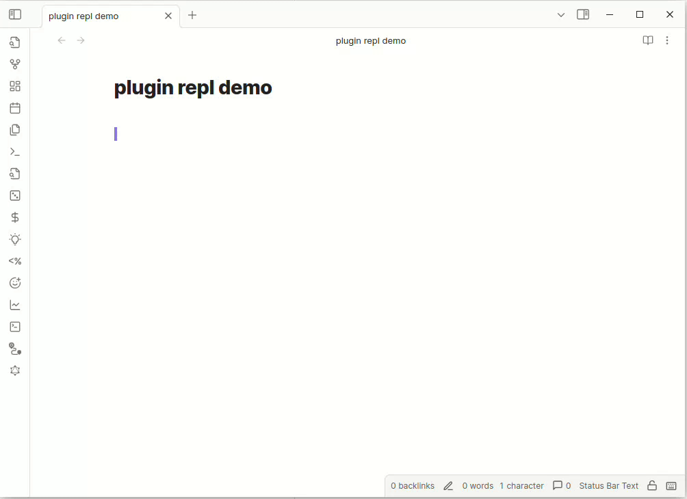

# Plugin repl - Scripting and Rapid Plugin Development
[@readwithai](https://x.com/readwithai) ([🦋](https://bsky.app/profile/readwithai.bsky.social), [𝕏](https://x.com/readwithai), [blog](https://readwithai.substack.com/), [▶️](https://www.youtube.com/@readerai/shorts), [support](https:://ko-fi.com/readwithai), [Plugin REPL docs](https://readwithai.substack.com/p/obsidian-plugin-repl))

This plugin adds an emacs-like read evaluate print loop (REPL) to Obsidian.
This lets you execute javascript directly in a document *and*, importantly, interact with Obsidian's plugin api to make Obsidian do things (like move the cursor, insert text, open files, etc).
You can also define new commands in javascript.

This can be useful when developing plugins, or for "light-weight" scripting without having to develop a full plugin yourself.

A range of convenience functions partly inspired by emacs is also provided.

*I am in no way affiliated with Obsidian. This is a third party plugin.*

# Demo


# Installation
In your obsidian vault there should be a `.obsidian/plugins` directory. You can clone this repo into that
directory and then run the following to build the plugin:

```
npm install
npm run dev
```

You should then be able to enable the plugin in the "Community Plugins" section of settings.

## Using
I would advise binding CTRL-J to the commamd: "Execute the current line or selection".

You can then write javascript expressions and then run commands to execute these expressions, return the result.
To define a command use the [newCommand](#commands) function.

For a lot of uses, the [convenience funcitons](#convenience) may well provide all the functional need.
But plugin repl also gives you access to much of [Obsidian's plugin API](https://docs.obsidian.md/Plugins/Getting+started/Build+a+plugin)
through the `app`, `editor` and `repl` (plugin) objects.

The `dir` and `fuzzyDir` methods can help explore these objects allong with the [API documentation](https://docs.obsidian.md/Plugins/Getting+started/Build+a+plugin).

## Documentation
This page provides an overview of functionality you might like to look at the [Obsidian and Plugin Repl Cookbook](https://readwithai.substack.com/p/obsidian-plugin-repl-cookbook) that provides various examples of how plugin repl can be used.

## Convenience functions provided
<a name="convenience"> </a>
Various convenience functions are provided:

* `source(f:string)` - Open the markdown file called f and execute the code in it
* `command(s:string)` - Run a command
* `newCommand(function name_with_underscores { ...)` - Create a new command with name "new name" which runs the function new_name
* `dir(o:Object)` - List the property in an object
* `fuzzyDir(o: Object)` - Explore the properties of an object with a fuzzy selector

### User interface
* `message(s:string)` - Print a notification message to the corner of the screen
* `popup(s: string)` - Popup a dialog displaying a message
* `promptString(prompt: string)` - Read a string from a popup
* `fuzzySelect(choices: Array<string>, prompt?: string)` - Select from an Array of strings
* `openFile(f:string)` - Open a file in the current pane
* `openUrl(url:string)` - Open a url

### Settings
* `openSetting(name: string)` - Open settings and display the tab (see left hand side) with the given name.
* `vaultPath` is the absolute path of the current vault

### Editor commands
* `path` is the path of the current note
* `lineNumber()` - return the line number of the current line
* `point()` - Return the current cursor position
* `mark()` - Return the cursor position at the  beginning of the selection
* `pointMin()` - Return the minimum cursor in the buffer
* `pointMax()` - Return the maximun cursor in the buffer
* `forwardChar(count?: number)` - Move count (or one) character forward
* `selection()` - Get the text contained in the selection

* `bufferString()` - Return a string containing the entire text of the buffer
* `bufferString(start, end)` - Return the string between these two cursor positions (see `point()` and `editor.getCursor()`)
* `insert(s:string)` - Insert a string into the buffer
* `kill(start?: cursor, end?: cursor)` - Delete a region (defaults to the selection)

* `wordAtPoint(p?:string)` - Returns the word at the cursor position. Default to current postion.
* `lineAtPoint(p?:string)` - Retunrs the line at the cursor position. Default to current positiong.

### Reading and files
* writeToFile(name: string) - Overwrite the markdown file called name with the given string
* appendToFile(name: string) - Append to the markdown file called `name` with the given string

### Processes
* `runProc(s: string)` - Parse the bash-style command string s (e.g "ls /home") and call runProc on it
* `runProc([command, arg1, arg2, ...])` - Run a command and return what it writes to standard out. Raise and error on error. See [require('child_process')](https://nodejs.org/api/child_process.html) for more advanced usage.

### Plugins
* `plugin(s:string)` - Get the object for a plugin. You may be able to reuse features from another plugin with this.
* `getDv()` - Get the dataview object

### API access
* `repl` is the plugin object for repl.
* `editor` is the editor object. You can use this to write to current-file
* `app` is the application object.


## Defining commands
<a name="commands"></a>
The function `newCommand` will create a new command from a function. You can then
define a hotkey to this command.

```javascript
&ewCommand(function command_name() {
...
})
```

creates a command with the name "new command name" (and the id `new_command_name`).
You can use all repl's extra functions and variables (`app`, `editor` etc) in this function.

If you want to test this funtion by hand you can do the following

```javascript
var f = makeNewCommand(function new_command_name() {
...
})
```

You can then call f() using eval to test the function.

## Running code at startup
If you want code to run at startup, such as for [defining commands](#commands) then you can place this code in a special file called `repl.md`. If this file exists it is read when obsidian starts (or is reloaded) and the code in it is executed.

## Asynchronous code
For convenience, if you call an asynchronous function, plugin repl will store the result of the call in the underscore variable (`_`) or, if there was an error, the error is stored in `_error`.

## Dataview support
The [dataview plugin](https://blacksmithgu.github.io/obsidian-dataview/) provides
functionality to query your obsidian vault. For example, it can return pages or bullet points that match a particular query.

If you have installed the dataview plugin, plugin repl gives you access to a dataview object `dv` which can be used to query pages.


The following code returns the first list of the page called `templates/daily.md`.

```javascript
dv = getDv()
dv.pages().filter((x) => x.file.path == "templates/daily.md")[0].file.lists[0]
```


## Importing modules
I experimented with the [obsidian modules](https://github.com/polyipseity/obsidian-modules) plugin but had issues importing full modules.

The approach I have used to getting access to modules when hacking on a new plugin is to create a new plugin and half that plugin set `self.MODULE = MODULE` on load. You can then access this self open from the repl.

## Some questions and answers about plugin repl
[Questions and answers](questions.md)

## Alternatives and prior work
* You can [use plugins](https://docs.obsidian.md/Plugins/Getting+started/Build+a+plugin) to do the same things that you can do with plugin-repl but this tends to mean more code.
* [js-engine](https://github.com/mProjectsCode/obsidian-js-engine-plugin) lets you evaulate javascript code in code blocks. [Execute code](https://github.com/twibiral/obsidian-execute-code) gives you code blocks in multiple languages. Neither give you access to obsidian objects to control obsidiate
* [dataview](https://blacksmithgu.github.io/obsidian-dataview/) similarly lets you execute javascript in box and gives you access to the app object.

# Attribution

This plugin was based on the [obsidian sample plugin](https://github.com/obsidianmd/obsidian-sample-plugin) from Obsidian.

It uses the [shell-quote](https://github.com/ljharb/shell-quote) by ljharb and the source code for this is compiled into the `main.js` file. This is under an MIT license.

At runtime, it binds against [dataview](https://blacksmithgu.github.io/obsidian-dataview/) if you use dataview functionality by by blacksmithg. This is under an MIT license.

## About me
*If you are interesting in this you might be interested in my [obsidian cookbook](https://medium.com/@readwithai/youtube-shorts-introduction-to-obsidian-56bd01506fa0).*

I make productivity tools and AI tools related to reading and research.
If that sounds interesting you can follow me on <a href="https://x.com/readwithai">twitter</a> or <a href="https://bsky.app/profile/readwithai.bsky.social">bluesky</a>.

I write about these topics on <a href="https://readwithai.substack.com/readwithai">substack</a>.

If you find *this* piece of software useful. Maybe give me money (like $10 dollars?) on my <a href="ko-fi.com/readwithai">kofi</a>.
